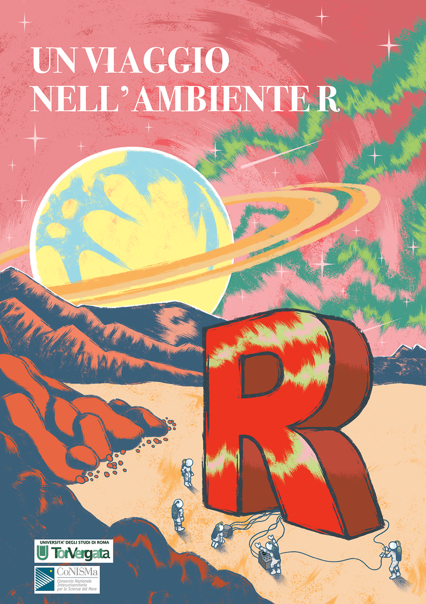
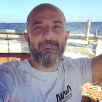
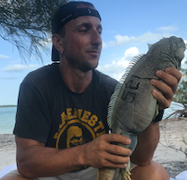
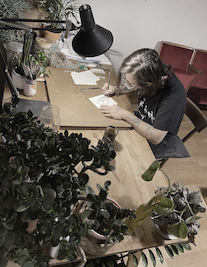
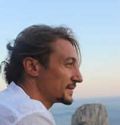
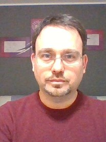

--- 
title: "Un viaggio nell'ambiente R"

author: 
- name: Tommaso Russo, Giuliano Colosimo, Ciro Fanelli, Simone Franceschini, Antonio Parisi

date: "2021-04-22"

output:
  html_document:
    toc: true
    toc_float: true
    theme: united
    toc_depth: 3
    
  pdf_document:
    toc: true
    highlight: zenburn

documentclass: book
link-citations: yes
bibliography: bioTS.bib
site: bookdown::bookdown_site
biblio-style: apalike

---

# Copertina {#Copertina}

# Prefazione {#Prefazione}

Sicuramente questo volume non rappresenta la prima risorsa, realizzata in lingua italiana, che punti a facilitare l'apprendimento e l'utilizzo dell'ambiente R. Una veloce ricerca nel web consente di trovare decine di predecessori, e certamente altre iniziative analoghe seguiranno. Infatti, una delle tante cose belle di *R* è che la sua **comunità**, in continua espansione, è inclusiva e coinvolgente... e questo perchè molti utenti sono catturati dal fascino di R e ne diventano degli appassionati sostenitori. E, infatti, le ragioni principali che hanno spinto gli autori a intraprendere questa iniziativa sono il fascino che questo strumento esercita su di loro e la grande importanza che riveste nel loro lavoro.   

Un famoso [sviluppatore](http://gotocon.com/dl/goto-aar-2012/slides/JohnCook_TheRLanguageTheGoodTheBadAndTheUgly.pdf) una volta ha detto che usare R è un pò come fumare: all'inizio è difficile e a qualcuno provoca il mal di testa o persino sintomi più gravi, ma alla lunga diventa piacevole e genera dipendenza! 

Non è esagerato dire che *R* è diventato una delle applicazioni di riferimento nell'ambito delle scienze teoriche ed applicate, e che la maggior parte dei corsi di studio relativi a discipline scientifiche ne richiede, ad un certo punto, l'apprendimento. Consapevoli di questo, questa avventura è iniziata sulla spinta del loro entusiasmo... ma anche con il preciso obiettivo di realizzare qualcosa di originale e potenzialmente utile per gli studenti di tanti corsi di laurea e scuole di dottorato. 

Per spiegare il senso di questo progetto è utile partire da quello che è già disponibile in rete (tralasceremo volutamente opere e materiali non disponibili liberamente online). A prima vista ci sono due principali tipologie di risorse:

* Dispense, manuali, e libri (classificabili principalemente a seconda della loro mole) che forniscono una **guida di base** per i neofiti.
* Monografie tematiche e manuali avanzati che affrontano nel dettaglio argomenti più complessi come la logica grafica del pacchetto **ggplot**

Quest'opera non vuole essere nessuna delle due... ed entrambe. Ci piacerebbe introdurre all'uso di R chi è digiuno di concetti di programmazione, ma anche mostrare quanto lontano si può arrivare... e quindi abbiamo organizzato il nostro lavoro in due blocchi: una di base, dedicata a chi deve partire da zero, e una più avanzata che tocca diversi temi applicativi, dall'analisi delle serie temporali a quella di dati genetici.

Il filo conduttore usato negli esempi e nell'approccio concettuale appartiene sempre al campo delle scienze naturali. D'altronde la squadra degli autori comprende due ecologi, uno statistico e uno zoologo... poi la competizione ha fatto il suo corso e l'opera ha preso una piega che privilegia temi come il cambiamento climatico e gli impatti dell'uomo sull'ambiente. Ma la vera storia dietro questo team e questa iniziativa è quella di un gruppo di colleghi a cui piace lavorare insieme e che hanno scoperto che le loro competenze si integrano con un arricchimento reciproco.

# Gli autori {#Autori}

E' professore associato di Ecologia presso il Dipartimento di Biologia dell'Università degli Studi di Roma Tor Vergata ed è affiliato al CONiSMa. Si occupa di modellistica ecologia applicata alle scienze della pesca e all'impatto dell'uomo sugli ambienti marini. Ha scritto il capitolo **Le Basi** di questo libro, e quello che sa di R lo ha imparato dagli altri... _in primis_ da Antonio Parisi.

***

E' un ricercatore postdoc con l'*Institute for Conservation Research* di San Diego (California) ma lavora in collaborazione con il Dipartimento di Biologia dell'Università degli Studi di Roma Tor Vergata. Il suo background è in genetica evoluzionistica e della conservazione e si occupa di diverse specie di rettili a rischio d'estinzione. Ha scritto il capitolo sulla **Genetica** ed è un importante esempio di _self-learning_, avendo imparato ad usare R tramite lunghe ore davanti al computer.

***

E' pittore, illustratore, tatuatore e scrittore. 
I suoi lavori sono apparsi su “La Lettura – Corriere della Sera”, “Vice”, “Esquire” e altre prestigiose riviste europee e giapponesi. 
Ha pubblicato "Pinocchio e Les corbeaux pleurent la merde" per Le Dernier Cri (Marsiglia,FR), per Rizzoli Lizard ha pubblicato "Nel bosco del nostro splendore".

***

 

E' un ricercatore postdoc che, come ecologo, si è focalizzato sull'applicazione di metodi statistici e computazionali negli ambienti di acqua dolce e marini, specializzandosi sull'analisi spaziale e lo sviluppo di algoritmi di Machine Learning. Negli ultimi anni si è occupato di ecologia della pesca, ecologia degli ambienti lotici, dello studio della distribuzione della plastica negli ambienti marini e dei suoi potenziali impatti sugli ecosistemi.

***

E' un ricercatore presso il Dipartimento di Economia e Finanza dell'Università degli Studi di Roma Tor Vergata, ma è prima di tutto un esperto di statistica che si diverta da tanti anni a collaborare con gli ecologi (usando R, ovviamente!).

***

